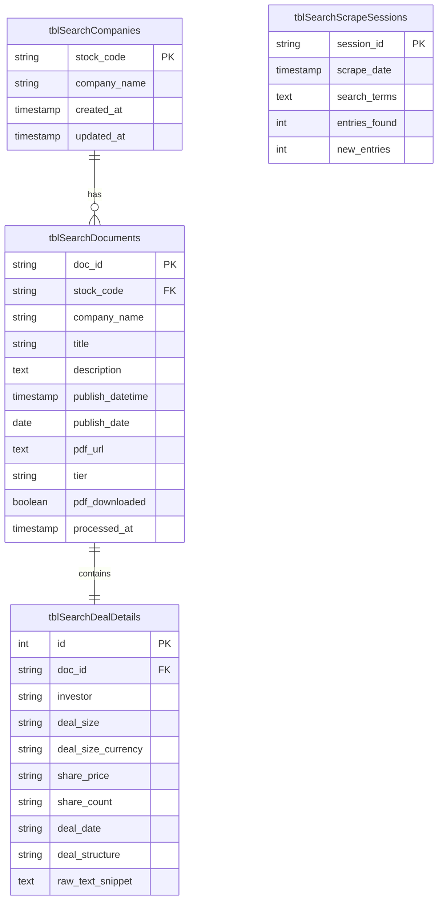

# TDnet Search Schema Documentation

This document explains the relationship between the SQL database tables (located in `sql/tdnet/search`) and the Pydantic models (located in `adoption/src/tdnet/search_models.py`).

## Database Schema Overview

The database uses a camelCase naming convention prefixed with `tbl` for tables and `idx` for indexes.

### Entity Relationship Diagram

## Model to Table Mapping

The Pydantic model `TdnetSearchEntry` is flattened for convenience in the scraper logic, but persisted across three related tables to ensure data normalization and integrity.

### 1. `TdnetSearchEntry` vs Database

| Model Field | Table | Column | Notes |
|-------------|-------|--------|-------|
| `doc_id` | `tblSearchDocuments` | `doc_id` | Primary Key / Unique Identifier |
| `stock_code` | `tblSearchCompanies` | `stock_code` | Reference to Company record |
| `company_name`| `tblSearchCompanies` | `company_name`| Denormalized in `tblSearchDocuments` for quick lookups |
| `title` | `tblSearchDocuments` | `title` | |
| `description` | `tblSearchDocuments` | `description` | |
| `date` | `tblSearchDocuments` | `publish_date` | Date component |
| `datetime_str`| `tblSearchDocuments` | `publish_datetime`| Parsed as Timestamp |
| `pdf_link` | `tblSearchDocuments` | `pdf_url` | |
| `tier` | `tblSearchDocuments` | `tier` | |
| `investor` | `tblSearchDealDetails`| `investor` | One-to-One relationship with Document |
| `deal_size` | `tblSearchDealDetails`| `deal_size` | |
| `deal_size_currency`| `tblSearchDealDetails`| `deal_size_currency`| |
| `share_price` | `tblSearchDealDetails`| `share_price` | |
| `share_count` | `tblSearchDealDetails`| `share_count` | |
| `deal_date` | `tblSearchDealDetails`| `deal_date` | |
| `deal_structure`| `tblSearchDealDetails`| `deal_structure`| |

### 2. `TdnetSearchResult` vs Database

The `TdnetSearchResult` model represents the outcome of a single execution/session and maps to `tblSearchScrapeSessions`.

| Model Field | Table | Column | Notes |
|-------------|-------|--------|-------|
| `scraped_at`| `tblSearchScrapeSessions`| `scrape_date` | |
| `total_count`| `tblSearchScrapeSessions`| `entries_found`| |
| `metadata` | `tblSearchScrapeSessions`| `search_terms` | Stored as JSON string |
| `entries` | `tblSearchDocuments` | (multiple) | Each entry in the list is UPSERTED |

## Persistence Logic

1. **Companies**: Upserted into `tblSearchCompanies` when encountered to maintain a clean list of unique companies.
2. **Documents**: Upserted into `tblSearchDocuments` using `doc_id` as the conflict key.
3. **Deal Details**: Extracted details (often from PDF analysis) are stored in `tblSearchDealDetails`, linked via `doc_id`. This table has a `ON DELETE CASCADE` constraint on the document reference.
4. **Sessions**: A new record is created in `tblSearchScrapeSessions` for every scraper run to track performance and results.
